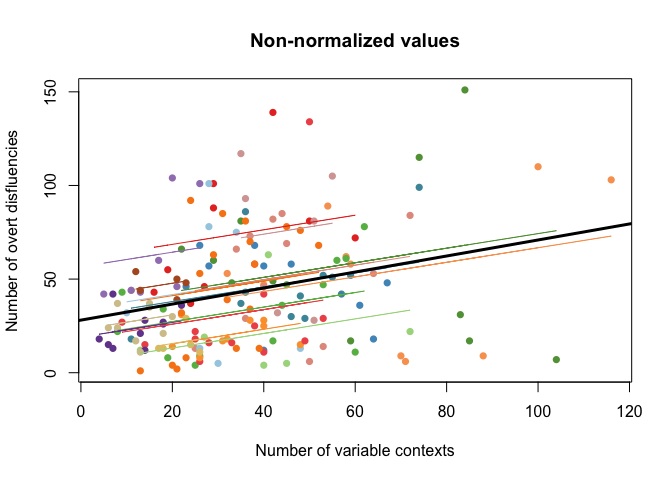
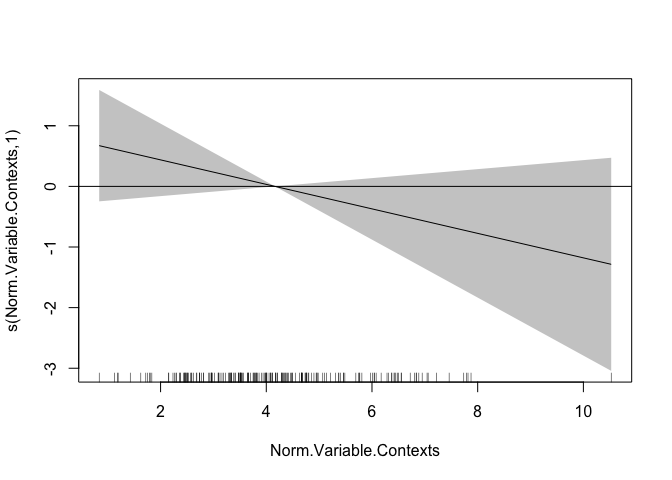

exploring\_SI
================

This file explores the data provided by Gardner et al. (MS, PLoS).

Libraries

``` r
library(dplyr)
library(ggplot2)
library(mgcv)
library(mgcViz)
library(lmerTest)
library(effects)
library(MASS)
library(rmcorr)
library(pwr)
```

Load the data.

``` r
dat = read.table("./02_supp_inf.txt", header=T, sep="\t", comment.char="", quote="")

# Some housekeeping
dat$Speaker_Number = as.factor(dat$Speaker_Number)

# We must compute normalized values ourselves (as these columns are not provided, which introduces another degree of freedom in comparing the results here to those reported).

# Function to normalize counts per 100 words
norm.fnc = function(var.ct, samp.size, norm.factor=100){
    prop = var.ct/samp.size
    norm.val = prop*norm.factor
    return(norm.val)
}

# Compute for total values: variable contexts, disfluencies and seconds.silence
dat$Norm.Variable.Contexts = norm.fnc(dat$Total.Variable.Contexts, dat$Total.Words)
dat$Norm.Overt.Disfluencies = norm.fnc(dat$Total.Overt.Disfluencies, dat$Total.Words)
dat$Norm.Seconds.Silence = norm.fnc(dat$Total.Seconds.Silence, dat$Total.Words)
```

Now, just check some of the figures in the text. - 190 transcripts -
9065 variable contexts - 34 speakers

``` r
# number of transcripts
cat(paste0("Number of transcripts = ", length(unique(dat$Audiofile)), "\n"))
```

    ## Number of transcripts = 183

``` r
# number of variable contexts
cat(paste0("Number of var. contexts from table = ", sum(dat$Total.Variable.Contexts), "\n"))
```

    ## Number of var. contexts from table = 6753

``` r
## Trying again, this time by computing the measures myself from the other columns
cols = 9:28
dat$CustomVarCon = apply(dat[, cols], 1, sum)
cat(paste0("Number of var. contexts from row sums = ", sum(dat$CustomVarCon), "\n"))
```

    ## Number of var. contexts from row sums = 6753

``` r
## and just to prove it:
cor.test(dat$Total.Variable.Contexts, dat$CustomVarCon) # identical
```

    ## 
    ##  Pearson's product-moment correlation
    ## 
    ## data:  dat$Total.Variable.Contexts and dat$CustomVarCon
    ## t = Inf, df = 195, p-value < 2.2e-16
    ## alternative hypothesis: true correlation is not equal to 0
    ## 95 percent confidence interval:
    ##  1 1
    ## sample estimates:
    ## cor 
    ##   1

``` r
# number of speakers
cat(paste0("Number of speakers = ", length(unique(dat$Speaker_Number)), "\n"))
```

    ## Number of speakers = 30

For some reason, I am not able to replicate the numbers reported in the
text. Perhaps the data had been pruned in a way I didn’t catch? I can
only assume that each speaker is from the same category (i.e., no males,
as reported in the text), so that the “Dyad” column does not combine
with the “Speaker\_Side” variable to indicate sex (i.e., it is not the
case that if Speaker\_Side = B and Dyad = Male, then the speaker is
male).

I find fewer unique files than reported (183 here vs. 190 reported) as
well as a much lower number of variable contexts (6,753 vs. 9,065). But
this appears to be the true value for the table as reflected by the row
sums.

Finally, I get fewer unique speakers than reported (30 vs. 34).

So we take a look at the basic properties of the data.

First, sizes of conversations. One would expect that the size of the
conversations dictates both the number of disfluencies, as well as the
number of opportunities for variabile structures to surface.

``` r
# Size of individual conversations
## Histogram
conv.size.hist = ggplot(dat, aes(Total.Words)) +
                 geom_histogram(aes(y = ..density..), color="darkblue", fill="white") +
                 geom_density(alpha=.2, fill="darkred") +
                 xlab("Number of words") +
                 ggtitle("Distribution of conversation lengths") +
                 theme_bw() +
                 theme(plot.title = element_text(hjust = 0.5))

conv.size.hist
```

<!-- -->

``` r
## ECDF plot
conv.size.ecdf = ggplot(dat, aes(Total.Words)) + 
                 stat_ecdf(geom = "step") +
                 xlab("Number of words") +
                 ylab("%") +
                 ggtitle("Distribution of conversation lengths") +
                 theme_bw() + 
                 theme(plot.title = element_text(hjust = 0.5))
                

conv.size.ecdf
```

<!-- --> The bulk
of the conversations contain fewer than 1500 words, and 3/4 of them
contain fewer than 1000. Thus, these samples are relatively small.

How many data points does each speaker produce?

``` r
tab = table(dat$Speaker_Number); sort(tab, decreasing=T)
```

    ## 
    ## 1236 1055 1126 1033 1106 1096 1018 1138 1389 1417 1135 1178 1011 1259 1053 
    ##   19   14   14   12   12   11   10   10   10   10    9    9    7    7    6 
    ## 1254 1600 1602 1044 1401 1373 1408 1454 1522 1603 1268 1502 1512 1519 1646 
    ##    6    5    5    3    3    2    2    2    2    2    1    1    1    1    1

``` r
speaker.freqs = data.frame(speaker = names(tab), freq = as.numeric(tab))

spkr.plot = ggplot(speaker.freqs, aes(freq)) +               
            geom_histogram(aes(y = ..density..), color="darkblue", fill="white") +
            geom_density(alpha=.2, fill="darkred") +
            xlab("Number of conversations") +
            ggtitle("Distribution of conversations per speaker") +
            theme_bw() +
            theme(plot.title = element_text(hjust = 0.5))

spkr.plot
```

<!-- -->

``` r
# Save speakers with >= 5 conversations
freq.spkrs = speaker.freqs %>%
             filter(freq >= 5)

freq.spkrs = pull(freq.spkrs, speaker)
```

Five speakers only contribute a single data point to the analysis. This
makes it difficult to assess how they would behave across multiple
contexts. But another point of concern is the relatively small number of
observations per participant. Recent work on the “replicability crisis”
has revealed that such low numbers – without expectations of huge effect
sizes (and/or proper power analyses) – results in estimates (e.g., of
correlation) that are (a) overestimated in terms of absolute magnitude,
(b) susceptible to flips in direction of effects depending on the
sample, and (c) at greater risk of both Type I and Type II error (see
the work of Vasishth and colleagues). The authors should carefully
consider this in their discussion and motivation of the methods they
employ.

As is typical with corpus data, we are dealing with unbalanced samples.
Being the most conservative, I plot our expectations for simple
correlations given the largest sample size in your dataset across three
expected effect sizes with alpha = 0.5.

``` r
# NB: I take this estimation of power from the paper which introduces rmcorr (Bakdash & Marusich, 2017): (N*(k-1)) + 1; N = # of participants, k = average number of observations

power.rmcorr = function(k, N, effectsizer, sig){
    pwr.r.test(n = ((N)*(k-1))+1, r = effectsizer, sig.level = sig) 
}

plot(density(speaker.freqs$freq)) # not normally distributed, so mean may not be the best
```

<!-- -->

``` r
k.mean = mean(speaker.freqs$freq)
k.med = median(speaker.freqs$freq)

## Means
# Small effect
power.rmcorr(k.mean, 30, .1, .05)$power
```

    ## [1] 0.2526044

``` r
# Medium effect
power.rmcorr(k.mean, 30, .3, .05)$power
```

    ## [1] 0.9786489

``` r
# Large effect
power.rmcorr(k.mean, 30, .5, .05)$power
```

    ## [1] 0.9999998

``` r
## Median
# Small effect
power.rmcorr(k.med, 30, .1, .05)$power
```

    ## [1] 0.2315323

``` r
# Medium effect
power.rmcorr(k.med, 30, .3, .05)$power
```

    ## [1] 0.9653734

``` r
# Large effect
power.rmcorr(k.med, 30, .5, .05)$power
```

    ## [1] 0.9999989

``` r
effect.sizes = seq(0.1, .5, .05)
vals.med = vector()
vals.mean = vector()
for(es in effect.sizes){
    curr.pwr.med = power.rmcorr(k.med, 30, es, .05)$power
    curr.pwr.mean = power.rmcorr(k.mean, 30, es, .05)$power
    vals.med = c(vals.med, curr.pwr.med)
    vals.mean = c(vals.mean, curr.pwr.mean)
}

vals = data.frame(Power = c(vals.mean, vals.med), k.type = rep(c("mean", "median"), each = length(effect.sizes)), effect.size = rep(effect.sizes, 2))

pwr.plot = ggplot(vals, aes(x = effect.size, y = Power, group = k.type, color = k.type)) +
           geom_point() + 
           geom_line() + 
           geom_hline(yintercept = .8, linetype=2) +
           theme_bw()

pwr.plot
```

<!-- -->

Results from either measure of central tendency suggest that your
analysis is only sufficiently powered for moderate effect sizes. Can the
authors provide some justification that they should expect these larger
effect sizes? Especially in light of the discussion they offer of the
many reasons why the aggregate picture of disfluency/silence per
conversation may be misleafing.

What about simply looking at the relationship between disfluency rates
and planning time, or either and number of variable contexts?

``` r
disXsil = ggplot(dat, aes(x = Norm.Overt.Disfluencies, y = Norm.Seconds.Silence, color = Speaker_Number, fill=Speaker_Number)) +
          xlab("# disfluencies") + 
          ylab("Silence (s)") +
          geom_smooth(method = lm, se=T, alpha=0.1) + 
          ylim(0, 80) +
          theme_bw()

disXsil
```

<!-- -->

``` r
disXvc = ggplot(dat, aes(y = Norm.Overt.Disfluencies, x = Norm.Variable.Contexts, color = Speaker_Number, fill = Speaker_Number)) +
          ylab("# disfluencies") + 
          xlab("# variable structures") +
          geom_smooth(method = lm, se=T, alpha=0.1) + 
          theme_bw()

disXvc
```

<!-- -->

``` r
silXvc = ggplot(dat, aes(y = Norm.Seconds.Silence, x = Norm.Variable.Contexts, color = Speaker_Number, fill = Speaker_Number)) +
          ylab("Silence (s)") + 
          xlab("# variable structures") +
          geom_smooth(method = lm, se=T, alpha=0.1) + 
          ylim(0, 80) +
          theme_bw()

silXvc
```

<!-- -->

An attempt at replicating the results of the rmcorr analysis

``` r
# Disfluencies and variable contexts (no control for sample size)
test.dis = rmcorr(Speaker_Number, Total.Variable.Contexts, Total.Overt.Disfluencies, dat[dat$Speaker_Number %in% freq.spkrs,])

plot(test.dis, overall=T, overall.lwd = 3, overall.col = "black", overall.lty = 1, xlab = "Number of variable contexts", ylab = "Number of overt disfluencies", main = "Non-normalized values")
```

<!-- -->

``` r
# Planning time and variable contexts (no control for sample size)
test.sil = rmcorr(Speaker_Number, Total.Variable.Contexts, Total.Seconds.Silence, dat)

plot(test.sil, overall=T, overall.lwd = 3, overall.col = "black", overall.lty = 1, xlab = "Number of variable contexts", ylab = "Seconds of silence", main = "Non-normalized values")
```

<!-- -->

So without normalizing per 100 words, we find an effect opposite to what
is reported in the paper. Now we try with normalized values.

``` r
# Normalized disfluencies
test.dis.norm = rmcorr(Speaker_Number, Norm.Variable.Contexts, Norm.Overt.Disfluencies, dat)

plot(test.dis.norm, overall=T, overall.lwd = 3, overall.col = "black", overall.lty = 1, xlab = "Number of variable contexts", ylab = "Number of overt disfluencies", main = "Normalized values (per 100 words)")
```

<!-- -->

``` r
# Noramlized seconds silence
test.sil.norm = rmcorr(Speaker_Number, Norm.Variable.Contexts, Norm.Seconds.Silence, dat)

plot(test.sil.norm, overall=T, overall.lwd = 3, overall.col = "black", overall.lty = 1, xlab = "Number of variable contexts", ylab = "Seconds of silence", main = "Normalized values")
```

<!-- -->

``` r
##################################
# Only speakers >= 5 conversations
##################################
# Normalized disfluencies
test.dis.norm.freq = rmcorr(Speaker_Number, Norm.Variable.Contexts, Norm.Overt.Disfluencies, dat[dat$Speaker_Number %in% freq.spkrs,])

plot(test.dis.norm.freq, overall=T, overall.lwd = 3, overall.col = "black", overall.lty = 1, xlab = "Number of variable contexts", ylab = "Number of overt disfluencies", main = "Normalized values (per 100 words; conversations > 5)")
```

<!-- -->

``` r
# Noramlized seconds silence
test.sil.norm.freq = rmcorr(Speaker_Number, Norm.Variable.Contexts, Norm.Seconds.Silence, dat[dat$Speaker_Number %in% freq.spkrs,])

plot(test.sil.norm.freq, overall=T, overall.lwd = 3, overall.col = "black", overall.lty = 1, xlab = "Number of variable contexts", ylab = "Seconds of silence", main = "Normalized values (conversations > 5)")
```

<!-- -->

These plots seem to replicate what is presented in the text. Even when
we remove the speakers that contribute 1, 2, or 3 data points only, the
effects weaken (i.e., approach null slopes).

Now we try some additional modeling techniques:

Poisson

``` r
pois.mod = glmer(Total.Overt.Disfluencies ~ Total.Variable.Contexts*Total.Words + (1|Speaker_Number), data=dat, family="poisson")

summary(pois.mod)
```

    ## Generalized linear mixed model fit by maximum likelihood (Laplace
    ##   Approximation) [glmerMod]
    ##  Family: poisson  ( log )
    ## Formula: 
    ## Total.Overt.Disfluencies ~ Total.Variable.Contexts * Total.Words +  
    ##     (1 | Speaker_Number)
    ##    Data: dat
    ## 
    ##      AIC      BIC   logLik deviance df.resid 
    ##   3489.7   3506.1  -1739.8   3479.7      192 
    ## 
    ## Scaled residuals: 
    ##     Min      1Q  Median      3Q     Max 
    ## -6.8084 -1.7644 -0.1416  1.8678 13.8633 
    ## 
    ## Random effects:
    ##  Groups         Name        Variance Std.Dev.
    ##  Speaker_Number (Intercept) 0.2505   0.5005  
    ## Number of obs: 197, groups:  Speaker_Number, 30
    ## 
    ## Fixed effects:
    ##                                       Estimate Std. Error z value Pr(>|z|)
    ## (Intercept)                          2.031e+00  1.182e-01  17.186   <2e-16
    ## Total.Variable.Contexts              1.941e-02  2.074e-03   9.357   <2e-16
    ## Total.Words                          1.657e-03  8.773e-05  18.893   <2e-16
    ## Total.Variable.Contexts:Total.Words -1.703e-05  1.580e-06 -10.777   <2e-16
    ##                                        
    ## (Intercept)                         ***
    ## Total.Variable.Contexts             ***
    ## Total.Words                         ***
    ## Total.Variable.Contexts:Total.Words ***
    ## ---
    ## Signif. codes:  0 '***' 0.001 '**' 0.01 '*' 0.05 '.' 0.1 ' ' 1
    ## 
    ## Correlation of Fixed Effects:
    ##             (Intr) Tt.V.C Ttl.Wr
    ## Ttl.Vrbl.Cn -0.474              
    ## Total.Words -0.535  0.487       
    ## Ttl.V.C:T.W  0.512 -0.893 -0.738
    ## fit warnings:
    ## Some predictor variables are on very different scales: consider rescaling
    ## convergence code: 0
    ## unable to evaluate scaled gradient
    ## Model failed to converge: degenerate  Hessian with 1 negative eigenvalues

``` r
qqnorm(resid(pois.mod)) 
```

<!-- -->

``` r
plot(allEffects(pois.mod), rescale.axis = F, rug=F)
```

<!-- -->

Seems to be compatible: however, there does appear to be an effect of
size of the conversation: shorter conversations show (slightly)
increasing trends, which gradually flip direction into a strong negative
trend.

Looking now for non-linearities

``` r
gam.pois = gam(Total.Overt.Disfluencies ~ te(Total.Variable.Contexts, Total.Words) + s(Speaker_Number, bs="re"), data=dat, family="poisson")

vis.gam(gam.pois, plot.type="contour", color = "heat")
```

<!-- -->

``` r
vis.gam(gam.pois, plot.type = "persp", color = "heat", theta=45)
```

<!-- -->

``` r
plotRGL(sm(getViz(gam.pois), 1), residuals=F)
```

Allowing for the non-linearities reveals some new patterns. For example,
for smaller conversations, the number of disfluencies decreases as a
function of the number of contexts, but then rebounds into a positive
slope in the upper ranges of that variable. For the longest
conversations, there is a sharp positive slope for the lower range of
numbers of variable contexts, which levels out. All of this to say that
the story is a bit more complex.

What happens if we look at the normalized freqs?

``` r
# Check distributional assumptions of the DV
boxcox(Norm.Overt.Disfluencies ~ 1, data = dat) # no tranformation needed
```

<!-- -->

``` r
# No need for the interaction with Total.Words as we have normalized the frequencies
gam.pois.norm = gam(Norm.Overt.Disfluencies ~ s(Norm.Variable.Contexts) + s(Speaker_Number, bs="re"), data=dat)

# Plot the results
plot(gam.pois.norm, sel=1, shade=T)
abline(h=0)
```

<!-- -->

``` r
# And check the summary
summary(gam.pois.norm)
```

    ## 
    ## Family: gaussian 
    ## Link function: identity 
    ## 
    ## Formula:
    ## Norm.Overt.Disfluencies ~ s(Norm.Variable.Contexts) + s(Speaker_Number, 
    ##     bs = "re")
    ## 
    ## Parametric coefficients:
    ##             Estimate Std. Error t value Pr(>|t|)    
    ## (Intercept)   5.1028     0.4497   11.35   <2e-16 ***
    ## ---
    ## Signif. codes:  0 '***' 0.001 '**' 0.01 '*' 0.05 '.' 0.1 ' ' 1
    ## 
    ## Approximate significance of smooth terms:
    ##                             edf Ref.df     F  p-value    
    ## s(Norm.Variable.Contexts)  1.00      1 2.140    0.145    
    ## s(Speaker_Number)         20.39     29 2.405 3.43e-07 ***
    ## ---
    ## Signif. codes:  0 '***' 0.001 '**' 0.01 '*' 0.05 '.' 0.1 ' ' 1
    ## 
    ## R-sq.(adj) =  0.277   Deviance explained = 35.6%
    ## GCV =   7.74  Scale est. = 6.8604    n = 197

Here we see an effect very similar to the one reported in the paper.
Thus, it appears that the manner in which the sample sizes are
controlled for influences the relationship between the variables of
interest. The negative trend always emerges, but some of the effects at
the extremes are rendered invisible by this approach. When the
frequencies are modeled as interacting with the sample size, some
(non-linear) trends emerge, but only for the smallest and largest sample
sizes.

Now for seconds of silence.

``` r
# Check distributional assumptions of the DV
boxcox(lm(dat$Total.Seconds.Silence~1)) # indicates a log transform (lambda ~ 0)
```

<!-- -->

``` r
# Transform response
dat$tSecs = log(dat$Total.Seconds.Silence)

sil.mod = lmer(tSecs ~ Total.Variable.Contexts*Total.Words + (1|Speaker_Number), data=dat)

anova(sil.mod)
```

    ## Type III Analysis of Variance Table with Satterthwaite's method
    ##                                     Sum Sq Mean Sq NumDF  DenDF F value
    ## Total.Variable.Contexts             6.6254  6.6254     1 187.06 16.1123
    ## Total.Words                         0.9070  0.9070     1 174.05  2.2057
    ## Total.Variable.Contexts:Total.Words 4.7421  4.7421     1 187.03 11.5323
    ##                                        Pr(>F)    
    ## Total.Variable.Contexts             8.631e-05 ***
    ## Total.Words                         0.1393129    
    ## Total.Variable.Contexts:Total.Words 0.0008353 ***
    ## ---
    ## Signif. codes:  0 '***' 0.001 '**' 0.01 '*' 0.05 '.' 0.1 ' ' 1

``` r
plot(allEffects(sil.mod))
```

<!-- -->

Here, see a reverse sort of pattern (i.e., the effect reported in the
paper holds for the smaller transcripts but not for the larger ones).

But if we look at the normalized values only:

``` r
# Check distributional assumptions of the DV
boxcox(lm(dat$Norm.Seconds.Silence~1)) # indicates a log transform (lambda ~ 0)
```

<!-- -->

``` r
# Transform response
dat$tSecsNorm = log(dat$Norm.Seconds.Silence)

sil.mod = lmer(tSecsNorm ~ Norm.Variable.Contexts + (1|Speaker_Number), data=dat)

anova(sil.mod)
```

    ## Type III Analysis of Variance Table with Satterthwaite's method
    ##                        Sum Sq Mean Sq NumDF  DenDF F value  Pr(>F)  
    ## Norm.Variable.Contexts 3.0311  3.0311     1 194.86  6.0609 0.01469 *
    ## ---
    ## Signif. codes:  0 '***' 0.001 '**' 0.01 '*' 0.05 '.' 0.1 ' ' 1

``` r
plot(allEffects(sil.mod))
```

<!-- -->

And now, what happens if we allow for some non-linearities?

``` r
sil.mod.gamm = gam(tSecs ~ te(Total.Variable.Contexts, Total.Words) + s(Speaker_Number, bs="re"), data = dat)

summary(sil.mod.gamm)
```

    ## 
    ## Family: gaussian 
    ## Link function: identity 
    ## 
    ## Formula:
    ## tSecs ~ te(Total.Variable.Contexts, Total.Words) + s(Speaker_Number, 
    ##     bs = "re")
    ## 
    ## Parametric coefficients:
    ##             Estimate Std. Error t value Pr(>|t|)    
    ## (Intercept)  4.43949    0.07632   58.17   <2e-16 ***
    ## ---
    ## Signif. codes:  0 '***' 0.001 '**' 0.01 '*' 0.05 '.' 0.1 ' ' 1
    ## 
    ## Approximate significance of smooth terms:
    ##                                            edf Ref.df     F  p-value    
    ## te(Total.Variable.Contexts,Total.Words)  7.459  9.268 2.536 0.008787 ** 
    ## s(Speaker_Number)                       13.878 29.000 1.105 0.000852 ***
    ## ---
    ## Signif. codes:  0 '***' 0.001 '**' 0.01 '*' 0.05 '.' 0.1 ' ' 1
    ## 
    ## R-sq.(adj) =  0.284   Deviance explained = 36.2%
    ## GCV = 0.4501  Scale est. = 0.39906   n = 197

``` r
vis.gam(sil.mod.gamm, plot.type="contour", color = "heat")
```

<!-- -->

``` r
vis.gam(sil.mod.gamm, plot.type = "persp", color = "heat", theta=45)
```

<!-- -->

``` r
plotRGL(sm(getViz(sil.mod.gamm), 1), residuals=F)
```

So there is something going on here, but the confidence planes suggest
that it is really not of much interest. Generally, the effect of
variable contexts is positive for the smaller conversations and null or
slightly negative for the longer conversations (almost identical to what
we see in the linear model above).

…and normalized values?

``` r
sil.mod.gamm.norm = gam(tSecsNorm ~ s(Norm.Variable.Contexts) + s(Speaker_Number, bs="re"), data = dat)

summary(sil.mod.gamm.norm)
```

    ## 
    ## Family: gaussian 
    ## Link function: identity 
    ## 
    ## Formula:
    ## tSecsNorm ~ s(Norm.Variable.Contexts) + s(Speaker_Number, bs = "re")
    ## 
    ## Parametric coefficients:
    ##             Estimate Std. Error t value Pr(>|t|)    
    ## (Intercept)    2.532      0.114   22.21   <2e-16 ***
    ## ---
    ## Signif. codes:  0 '***' 0.001 '**' 0.01 '*' 0.05 '.' 0.1 ' ' 1
    ## 
    ## Approximate significance of smooth terms:
    ##                              edf Ref.df     F  p-value    
    ## s(Norm.Variable.Contexts)  1.513  1.849 2.910    0.047 *  
    ## s(Speaker_Number)         19.561 29.000 2.346 2.44e-07 ***
    ## ---
    ## Signif. codes:  0 '***' 0.001 '**' 0.01 '*' 0.05 '.' 0.1 ' ' 1
    ## 
    ## R-sq.(adj) =  0.274   Deviance explained = 35.2%
    ## GCV = 0.55354  Scale est. = 0.49152   n = 197

``` r
plot(sil.mod.gamm.norm, sel=1, shade=T)
abline(h=0)
```

<!-- -->

Here we replicate the positive trend reported in the paper, with very
little curvature.

I leave it at this. It appears that the patterns you report are truly
present in this dataset. However, the issues with power (along with
myriad other questions concerning the nature of variability in situ – is
there always a choice where there “could” be one?, the distributions of
disfluencies/pauses relative to specific types of structures in real
time, etc.) still leave room for some skepticism.
